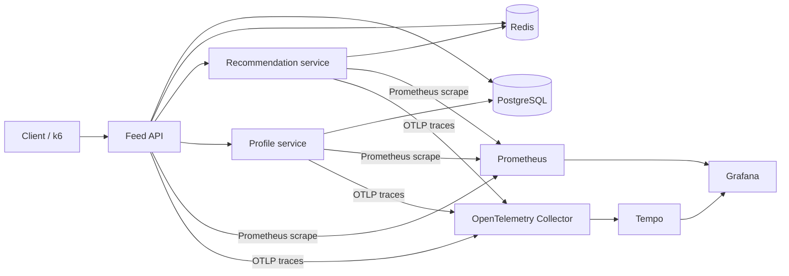

# Go production observability lab architecture

## Purpose

This system demonstrates how a high-traffic Go platform can connect low-cardinality
metrics, structured logs, distributed traces, protected incident snapshots, and
controlled failure injection. It is a local architecture laboratory, not a claim
that one laptop has processed one billion production requests.



## Request and observability flow

1. `feed-api` receives `GET /v1/feed` and starts a W3C server span.
2. It checks Redis and, on a miss, reads PostgreSQL while calling profile and
   recommendation services concurrently.
3. The OpenTelemetry HTTP transport injects `traceparent` downstream.
4. Every service log emitted with the request context includes `trace_id` and
   `span_id`; responses expose `X-Trace-ID` for support workflows.
5. Prometheus histograms store the trace ID as an exemplar. Trace IDs are never
   metric labels, so trace correlation does not create unbounded cardinality.
6. Grafana reads time series from Prometheus and resolves clicked exemplars in Tempo.
7. During an incident, the authenticated snapshot endpoint correlates recent
   error logs, heap/GC gauges, and grouped goroutine stacks from one process.

## Capacity model

The daily-volume targets translate to the following request rates:

| Daily requests | Average RPS | 10x peak design RPS |
|---:|---:|---:|
| 1 crore (10 million) | 116 | 1,157 |
| 10 crore (100 million) | 1,157 | 11,574 |
| 100 crore (1 billion) | 11,574 | 115,741 |

Do not convert these numbers directly into replica counts. First measure the
sustainable per-pod RPS at the SLO latency while holding CPU around 60–70% and
keeping database/Redis saturation below 70%. Then use:

```text
replicas = ceil(peak_RPS / measured_RPS_per_pod / target_utilization)
```

At the billion-request target, the API tier should be stateless and horizontally
scaled across at least three availability zones. Redis should use sharding and
replication; PostgreSQL needs read replicas, partitioning based on observed table
growth, connection proxies such as PgBouncer, and strict per-instance pool budgets.
The sum of all application pools must remain below the database's safe connection
limit.

## Metrics data-point model

Metrics are aggregated in process; the system never writes one metric record per
request. With 10,000 active time series and a 10-second scrape interval:

```text
10,000 × 8,640 scrapes/day = 86.4 million metric samples/day
```

Route templates, fixed HTTP methods/statuses, dependency names, and operation
allowlists bound cardinality. User IDs, raw URLs, trace IDs, request IDs, error
messages, and tenant IDs are forbidden metric labels.

## Service-level objectives

| Indicator | Objective | Alert signal |
|---|---:|---|
| Availability | 99.9% successful requests / 30 days | 5xx ratio and multi-window burn rate |
| Feed latency p95 | <250 ms | `HTTPP95LatencyHigh` |
| Feed latency p99 | <750 ms | `HTTPP99LatencyCritical` |
| Dependency errors | <1% | dependency outcome rate |
| Telemetry overhead | <2% CPU and <1 ms p95 | before/after load benchmark |

The supplied alerts use a short local-lab window so they can be demonstrated.
A production deployment should use fast and slow error-budget burn alerts instead
of a single threshold window.

## Scaling decisions

- Cache only bounded, versioned responses with short TTLs and request coalescing
  before introducing long-lived cache state.
- Apply timeouts, bounded retries with jitter, circuit breaking, and concurrency
  limits at every downstream boundary. Retries consume a shared retry budget.
- Autoscale on a combination of CPU, request concurrency, queue depth, and p95
  latency. CPU alone misses connection-pool and downstream saturation.
- Use tail-based trace sampling in the collector at scale: retain errors and slow
  traces while sampling a small percentage of healthy traffic.
- Sample successful access logs with `ACCESS_LOG_SAMPLE_RATIO` (the code defaults
  to 1%; the local Compose lab overrides it to 100% for demonstration). All 5xx
  outcomes are logged regardless of sampling. Size retention from measured log
  bytes per request; do not attempt to retain one log per billion requests.
- Remote-write Prometheus data to Mimir, Thanos, or VictoriaMetrics for durable,
  horizontally scalable retention. The local Prometheus instance is intentionally
  single-node.

## Failure recovery

- **PostgreSQL unavailable:** fail readiness, shed traffic, preserve a bounded
  stale cache where product requirements allow, and recover pools gradually.
- **Redis unavailable:** degrade to PostgreSQL with concurrency limits; prevent a
  cache-miss stampede using request coalescing.
- **Recommendation unavailable:** serve the feed without recommendations, as the
  sample service does, and alert on the degraded dependency.
- **Profile unavailable:** return a partial response when the product contract
  allows it; never let an optional dependency consume the entire request budget.
- **Retry storm:** stop retries with a budget/circuit breaker and prioritize fresh
  user traffic over background retries.
- **Goroutine or memory growth:** take the bounded incident snapshot, compare stack
  group counts, capture a time-limited pprof profile on a private interface, then
  rollback or drain affected instances.

## Security and production boundaries

- Metrics, diagnostics, and failure-lab endpoints must be on a private listener
  protected by service identity, not the public API listener used in this lab.
- The failure lab is disabled by default in Go code, token protected, resource
  capped, and intended only for isolated environments.
- Replace local passwords with a secret manager and rotate all credentials.
- Add TLS/mTLS between services and collectors before deployment outside a laptop.
- Do not expose stack traces or retained error fields to end users.
